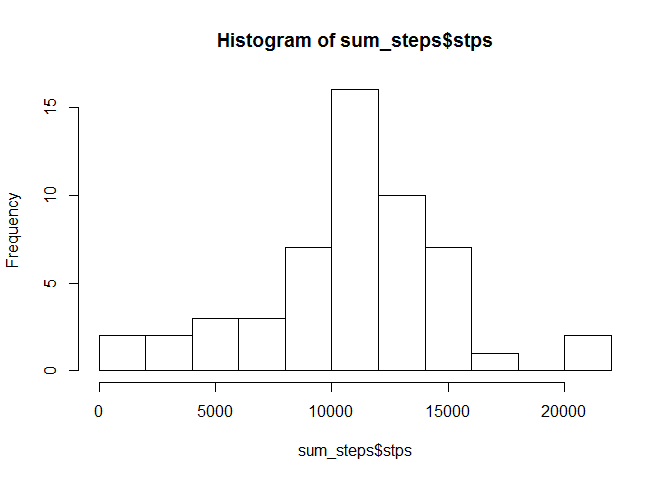

# Reproducible Research: Peer Assessment 1


## Loading and preprocessing the data
Information regarding the estructu


```r
library(dplyr)
```

```
## 
## Attaching package: 'dplyr'
## 
## The following objects are masked from 'package:stats':
## 
##     filter, lag
## 
## The following objects are masked from 'package:base':
## 
##     intersect, setdiff, setequal, union
```

```r
data <- read.csv("data/activity.csv")
# Average (mean) number of steps by date
by_date <- group_by(data,date )
sum_steps <- summarise(by_date,stps=sum(steps))
```


## What is mean total number of steps taken per day?

```r
hist(sum_steps$stps, breaks=15)
```

 

From the histogram, it is clear that the mean equals to 1.0766189\times 10^{4} and the median is 1.0765\times 10^{4}.


## What is the average daily activity pattern?


## Imputing missing values


## Are there differences in activity patterns between weekdays and weekends?
