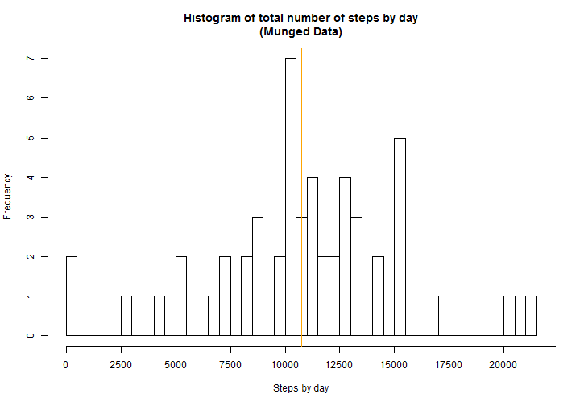

## Loading and preprocessing the data
As estated in the assignement, this assignment makes use of data from a personal activity monitoring devices, collected at 5 minute intervals through out the day. 

The data consists of two months of measures from an anonymous individual collected during the months of October and November, 2012 and include the number of steps taken in 5 minute intervals each day.


```r
library(plyr)

options(scipen=2,digits=0) # To avoid problems with scientific format for numbers > 10E+4

# Loading data
data <- read.csv("data/activity.csv")

#Converting dates to .Date objects
data$date <- as.Date(data$date)

# Calculating some series and values for further questions
num_readings <- nrow(data)
num_na <- sum(is.na(data$steps))
sum_steps <- ddply(data,c("date"),summarise, stps = sum(steps))
count_steps <- ddply(data,c("date"),summarise, N = length(steps))
reading_per_day = mean(count_steps$N)
```

There are a total of ``17568`` records in the file with three values each: num of steps taken for the 5 minute interval, date of the reading and the 5 minute interval number within the day.

There are ``2304`` missing steps values and ``15264`` valid measures.

*NOTE: Values within the text are computed by *

```r
num_readings
```

```
## [1] 17568
```

```r
num_na
```

```
## [1] 2304
```

```r
num_readings - num_na
```

```
## [1] 15264
```


## What is mean total number of steps taken per day?

```r
# ceiling is used as it is not possible to perform half a step.
mean_steps <- ceiling(mean(sum_steps$stps,na.rm=TRUE))
median_steps <- ceiling(quantile(sum_steps$stps,0.5,na.rm = TRUE))
max_steps <- max(sum_steps$stps,na.rm=TRUE)+3000
hist(sum_steps$stps, breaks=reading_per_day/6, xlab="Steps by day",
     main="Histogram of total number of steps by day",xaxt='n') #Breaks each half an hour

axis(side=1,at=seq(0,max_steps,2500),labels=seq(0,max_steps,2500))
abline(v=mean_steps,col="red")
abline(v=median_steps,col="orange")
```

 

From the histogram, it is clear that the mean equals to ``10767`` and the median is ``10765``.

*NOTE: Values within the text are computed by *

```r
mean_steps
```

```
## [1] 10767
```

```r
median_steps
```

```
##   50% 
## 10765
```


## What is the average daily activity pattern?
Browsing through the data, there is not an clear pattern that can come out from the data. Plotting the average number of steps against the interval number it is possible to see a better pattern.


```r
interval_means <- ddply(data, c("interval"),summarise, stps=mean(steps,na.rm=TRUE))
max_steps=max(interval_means$stps,na.rm = TRUE)

plot(y=interval_means$stps,x=interval_means$interval,type="l",xlab="Interval number",
     ylab="Steps (mean)", main="Evolution of the average number of steps")
abline(v=interval_means$interval[interval_means$stps==max_steps],col="red")
```

 

In the graph (red line) it is marked the interval where the maximum number of steps is found :``206`` steps at interval ``835``).

*NOTE: Values within the text are computed by *

```r
max_steps
```

```
## [1] 206
```

```r
interval_means$interval[interval_means$stps==max_steps]
```

```
## [1] 835
```


## Imputing missing values
The original data set contains 17568 rows, but not all them have a value. There are 2304 empty measures.

To complete the series, we will compute the mean value for the interval for each of the 288 measures by day, using the average value for the step in the day by the day of the week. This will allow us to minimise the byas in the nature of the measures by day, if any.

This is the table of the sustitution values:


```r
dataMunged <- data
for (x in 1:nrow(dataMunged)) {
  if (is.na(dataMunged$steps[x])) {
    interval_index <- dataMunged$interval[x]/5 + 1
    dataMunged$steps[x] <- interval_means$stps[interval_index]
  } 
}
sum_steps2 <- ddply(dataMunged,c("date"),summarise, stps = sum(steps))

mean_steps <- ceiling(mean(sum_steps2$stps,na.rm=TRUE))
median_steps <- ceiling(quantile(sum_steps2$stps,0.5,na.rm = TRUE))
max_steps <- max(sum_steps2$stps,na.rm=TRUE)+3000


hist(sum_steps2$stps, breaks=reading_per_day/6, xlab="Steps by day",
     main="Histogram of total number of steps by day\n(Munged Data)",xaxt='n') #Breaks each half an hour
axis(side=1,at=seq(0,max_steps,2500),labels=seq(0,max_steps,2500))
abline(v=mean_steps,col="red")
abline(v=median_steps,col="orange")
```

 

From the histogram, it is clear that the mean equals to ``10767`` and the median is ``10765``. These are the very same values than for the original data set. Our strategy of sustitution is according to the propesties of the arithmetic mean, and does not change the distribution of values.


*NOTE: Values within the text are computed by *

```r
nrow(data)
```

```
## [1] 17568
```

```r
sum(is.na(data$steps))
```

```
## [1] 2304
```

```r
mean(count_steps$N)
```

```
## [1] 288
```

```r
ceiling(mean(sum_steps2$stps,na.rm=TRUE))
```

```
## [1] 10767
```

```r
quantile(sum_steps2$stps,0.5,na.rm=TRUE)
```

```
##   50% 
## 10765
```


## Are there differences in activity patterns between weekdays and weekends?

Classifying the values in two classes: one for "weekdays" and other for "weekends", our data can be displayed as two differen series

```r
weekday <- weekdays(as.Date(dataMunged$date))
for (x in 1:length(weekday)) {
  if (weekday[x] %in% c("sábado","domingo")) 
    weekday[x] <- "weekend"
  else
    weekday[x] <- "weekday"
}

dataMunged <- cbind(dataMunged, weekday)

wd_steps <- ddply(dataMunged,c("weekday","interval"),summarise, mean_stps = mean(steps,na.rm = TRUE))

steps_weekday <- wd_steps[wd_steps$weekday=="weekday",]
steps_weekend <- wd_steps[wd_steps$weekday=="weekend",]

par(mfrow=c(2,1))
par(mar=c(1,4,4,4))
plot(y=steps_weekday$mean_stps,x=steps_weekday$interval,type="l",xaxt='n',xlab="",
     ylab="Weekday",ylim=c(min(wd_steps$mean_stps),max(wd_steps$mean_stps)),
     main="Mean number of steps by interval by type of day")
axis(1,labels=FALSE)
par(mar=c(4,4,0,4))
plot(y=steps_weekend$mean_stps,x=steps_weekend$interval,type="l",xlab="Interval number",ylab="Weekend",ylim=c(min(wd_steps$mean_stps),max(wd_steps$mean_stps)))
```

 

```r
par(mfrow=c(1,1))
```
The upper series shows the mean steps performed on weekdays and the one below shows the steps on weekends.

There is an evidence of a diferent behaviour between weekdays and weekends but there is no data that can explain the difference.
